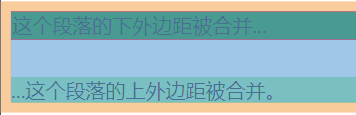

# 外边距塌陷

> 块的顶部外边距和底部外边距有时被组合(折叠)为单个外边距，其大小是组合到其中的最大外边距，这种行为称为**外边距塌陷(margin collapsing)**

发生外边距塌陷的三种基本情况:

- **相邻的兄弟姐妹元素**

  毗邻的两个兄弟元素之间的外边距会塌陷

  ```html
  <p style="margin-bottom: 30px;">这个段落的下外边距被合并...</p>
  <p style="margin-top: 20px;">...这个段落的上外边距被合并。</p>
  ```
  

  可以发现这两个段落中间的距离，不是 ”上面段落的下边距“ 与 ”下面段落的上边距“ 的 求和 ，而是两者中的较大者（在此示例中为30px）。
  
- **块级父元素与其第一个/最后一个子元素**

  如果块级父元素中，不存在**上边框**、**上内边距**、**内联元素**、**块格式化上下文**、 **清除浮动** 这五条（也可以说，当上边框宽度及上内边距距离为0时），那么这个块级元素和其第一个子元素的上边距就可以说**挨到了一起**。此时这个块级父元素和其第一个子元素就会发生上外边距合并现象，换句话说，此时这个父元素对外展现出来的外边距将直接变成这个父元素和其第一个子元素的`margin-top`的较大者。

  ```html
  <div style="margin-top:10px;">
    <p id="p1" style="margin-top: 30px;">这个段落的上外边距被合并...</p>
  </div>

  div 的 margin-top 与 p 的 margin-top 合并了，为30px
  ```
  
  

  `div`的`margin-top`（在此示例中为30px）。

  类似的，若块级父元素的 `margin-bottom` 与它的最后一个子元素的`margin-bottom` 之间没有父元素的 `border`、`padding`、`inline content`、`height`、`min-height`、` max-height` 分隔时，就会发生 下外边距合并 现象。

- **空块元素**

  如果存在一个空的块级元素，其 border、padding、inline content、height、min-height 都不存在。那么此时它的上下边距中间将没有任何阻隔，此时它的上下外边距将会合并。例如：

  ```html
  <p style="margin-bottom: 0px;">这个段落的和下面段落的距离将为20px</p>

  <div style="margin-top: 20px; margin-bottom: 20px;"></div>

  <p style="margin-top: 0px;">这个段落的和上面段落的距离将为20px</p>
  ```

## 负边距

当有负边距存在时，合并后的外边距将是最大正边距加上最小负边距（即负边距中绝对值最大的一个）。

如两个兄弟元素，上面的元素的下边距为 20px ，下面的元素的上边距为 -20px ，那么发生外边距合并后，这两个元素的实际距离将变成 0px 。