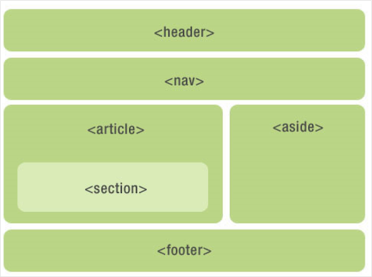

# 语义化

## 什么是语义化

  语义化是指根据内容的结构化（内容语义化），选择合适的标签（代码语义化），便于开发者阅读和写出更优雅的代码的同时，让浏览器的爬虫和机器很好的解析。

  关于**语义化**，通俗的说，语义化就是用正确的标签做正确的事情，表达正确的意思。

## 为什么要语义化呢？

  > 维基百科：标签语义化有助于构架良好的html结构，有利于搜索引擎的建立索引、抓取；另外，亦有利于页面在不同的设备上显示尽可能相同；此外，亦有利于构建清晰的机构，有利于团队的开发、维护。

  - 清晰的页面结构

    去掉或样式丢失的时候,也能让页面呈现清晰的结构，增强页面的可读性。

  - 有利于[`SEO`](../SEO/SEO.md):

    搜索引擎的爬虫是读不懂无语义的`span`和`div`的，因此语义化标签能使爬虫抓取更多的有效信息。

  - `CSS`文件读取失败的准备：
  
    万一`CSS`文件挂了，语义化的HTML也能呈现较好的内容结构与代码结构。

  - 方便其它设备的解析(如屏幕阅读器、盲人阅读器、移动设备)：

    屏幕阅读器（如果访客有视障）会完全根据你的标记来“读”你的网页。 如果你使用的含语义的标记,屏幕阅读器会根据你的标签来判断网页的内容，而不是一个字母一个字母的拼写出来。

  - 便于团队开发和维护。

## 如何语义化

  - ### 语义化的HTML结构首先要强调HTML结构

    `html5` 的部分布局标签
    
    标签 | 描述
    ---|---
    header | 定义页眉
    footer | 定义页脚
    section | 定义节
    article | 定义文章
    aside | 定义页面内容之外的内容
    nav | 定义导航链接
    header | 定义页眉
    footer | 定义页脚

    

  - ### 正确地使用标签

      [HTML标签大全](https://developer.mozilla.org/zh-CN/docs/Web/HTML/Element) 

    - **图片**：`img`标签，注意设置`alt`属性

      ```html
      
      ```

      如果图片中包含了重要信息，最好也写到标签里再用**样式隐藏**掉。比如考拉的商品详情页，商品信息都是图片来展示的，这对`seo`很不利，应该把图片中重要的信息写到标签里并且隐藏掉，图片不能完全替代网页元素，这也是应该养成的习惯。

      ```html
      <div>
         
        <div style="display:none;">
          <p>此处展示图片中的信息</p>
        </div>
      </div>
      ```

    - **图片新标签**：`figure` 属于 `html5`，语义是文档中的插图

      ```html
      <figure>
        
        <figcaption>shanghai_lupu_bridge</figcaption>
      </figure>
      ```

    - **关于`<b> & <strong>, <i> & <em>`**
      - `<b>`仅仅只是加粗，并没有任何语义。但是`<strong>`标签则有语气加重的强调的意思

      - `<i>`仅仅只是斜体显示，并没有任何语义。但是`<em>`标签则有加强的语义在内。

      - `<em>`的全称是: emphasis, 意思为强调。

        `<strong>`的全称是: stronger emphasis, 是语气更强的强调

## 兼容骚操作 = =
  （网易考拉前端）
  移动端开发可以大胆用起来，PC端兼容方案：
  ```js
  var html5 = "abbr,article,aside,audio,canvas,datalist,details,dialog,eventsource,figure,footer,header,hgroup,mark,menu,meter,nav,output,progress,section,time,video".split(','),
  i = html5.length;
  while(i--) document.createElement(html5[i]);
  ```

---

[HTML5语义化(介绍自带义语义化的标签)--w3cplus](https://www.w3cplus.com/html5/semantics-tags.html)

[HTML语义化--网易考拉前端](https://kaola-fed.github.io/2016/01/05/HTML%E8%AF%AD%E4%B9%89%E5%8C%96/)

[HTML语义化标签探析](https://segmentfault.com/a/1190000004285858)