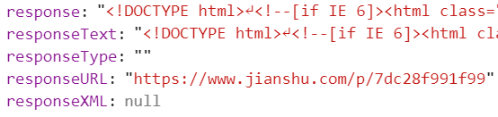

# `XMLHttpRequest`

- [`XMLHttpRequest`](#xmlhttprequest)
  - [Level](#level)
  - [如何使用呢？](#%E5%A6%82%E4%BD%95%E4%BD%BF%E7%94%A8%E5%91%A2%EF%BC%9F)
  - [`readyState` 属性](#readystate-%E5%B1%9E%E6%80%A7)
  - [发送请求的过程](#%E5%8F%91%E9%80%81%E8%AF%B7%E6%B1%82%E7%9A%84%E8%BF%87%E7%A8%8B)
    - [`open()` 初始化一个请求](#open-%E5%88%9D%E5%A7%8B%E5%8C%96%E4%B8%80%E4%B8%AA%E8%AF%B7%E6%B1%82)
    - [`setRequestHeader()` 设置 `request header`](#setrequestheader-%E8%AE%BE%E7%BD%AE-request-header)
    - [`timeout` 超时处理](#timeout-%E8%B6%85%E6%97%B6%E5%A4%84%E7%90%86)
    - [发送请求](#%E5%8F%91%E9%80%81%E8%AF%B7%E6%B1%82)
    - [中止请求](#%E4%B8%AD%E6%AD%A2%E8%AF%B7%E6%B1%82)
  - [响应](#%E5%93%8D%E5%BA%94)
    - [获取 `http` 请求的状态](#%E8%8E%B7%E5%8F%96-http-%E8%AF%B7%E6%B1%82%E7%9A%84%E7%8A%B6%E6%80%81)
    - [获取 `response header`](#%E8%8E%B7%E5%8F%96-response-header)
    - [指定 `response` 类型](#%E6%8C%87%E5%AE%9A-response-%E7%B1%BB%E5%9E%8B)
    - [获取响应的数据](#%E8%8E%B7%E5%8F%96%E5%93%8D%E5%BA%94%E7%9A%84%E6%95%B0%E6%8D%AE)
  - [进度](#%E8%BF%9B%E5%BA%A6)
  - [事件](#%E4%BA%8B%E4%BB%B6)
    - [事件触发](#%E4%BA%8B%E4%BB%B6%E8%A7%A6%E5%8F%91)
  - [`withCredentials` 跨域 与 `CORS`](#withcredentials-%E8%B7%A8%E5%9F%9F-%E4%B8%8E-cors)
  - [作为参考的ajax实现](#%E4%BD%9C%E4%B8%BA%E5%8F%82%E8%80%83%E7%9A%84ajax%E5%AE%9E%E7%8E%B0)
  - [参考资料](#%E5%8F%82%E8%80%83%E8%B5%84%E6%96%99)
---
## Level

  - level 1：
    - 受同源策略的限制，不能发送跨域请求

    - 不能发送二进制文件（如图片、视频、音频等），只能发送纯文本数据

    - 在发送和获取数据的过程中，无法实时获取进度信息，只能判断是否完成

  - level 2：

    - 可以发送跨域请求，在服务端允许的情况下

    - 支持发送和接收二进制数据

    - 新增`formData`对象，支持发送表单数据

    - 发送和获取数据时，可以获取进度信息

    - 可以设置请求的超时时间

## 如何使用呢？

  ``` javascript
  
  function sendAjax() {
    //构造表单数据
    var formData = new FormData();
    formData.append('username', 'johndoe');
    formData.append('id', 123456);
    
    //创建xhr对象 
    var xhr = new XMLHttpRequest();

    //设置xhr请求的超时时间
    xhr.timeout = 3000;

    //设置响应返回的数据格式
    xhr.responseType = "text";

    //创建一个 post 请求，采用异步
    xhr.open('POST', '/server', true);

    // 注册相关事件回调处理函数
    xhr.onload = function(e) { 
      if( this.status >= 200 && this.state < 300 || this.status == 304){
          alert(this.responseText);
      }
    };

    // 注意哦 ！！
    // 除了 onload 事件，也可以这样：
    xhr.onreadystateChange = function () {
      if(xhr.readyState == 4
        && this.status >= 200
        && this.state < 300
        || this.status == 304 ) {
          alert(this.responseText)
      }
    }

    // 超时
    xhr.ontimeout = function(e) { ... };
    // 出错
    xhr.onerror = function(e) { ... };
    // 上传进度
    xhr.upload.onprogress = function(e) { ... };
    
    //发送数据
    xhr.send(formData);
  }
  
  ```

---

## `readyState` 属性

  > `xhr.readyState` 这个属性可追踪到 `ajax` 请求的当前状态。这个属性是只读属性，总共有5种可能值，分别对应`xhr` 不同的不同阶段。每次`readyState` 的值发生变化时，都会触发 `onreadystatechange` 事件

| 值  | 状态                              | 描述                                                                                                                                             |
| --- | --------------------------------- | ------------------------------------------------------------------------------------------------------------------------------------------------ |
| 0   | `UNSENT` (初始状态，未打开)       | 此时xhr对象被成功构造，`open()`方法还未被调用                                                                                                    |
| 1   | `OPENED` (已打开，未发送)         | `open()`方法已被成功调用，`send()` 方法还未被调用。注意：只有`xhr`处于`OPENED`状态，才能调用 `xhr.setRequestHeader()` 和 `xhr.send()`,否则会报错 |
| 2   | `HEADERS_RECEIVED` (已获取响应头) | `send()` 方法已经被调用, 响应头和响应状态已经返回                                                                                                |
| 3   | `LOADING` (正在下载响应体)        | 响应体正在下载中，此状态下通过 `xhr.response` 可能已经有了响应数据                                                                               |
| 4   | `DONE` (整个数据传输过程结束)     | 整个数据传输过程结束，不管本次请求是成功还是失败                                                                                                 |

---
## 发送请求的过程

###  `open()` 初始化一个请求

  ``` javascript
  xhr.open(method, url, async(bool), user, pw);
  ```

### `setRequestHeader()` 设置 `request header`

  - `setRequestHeader`必须在`open()`方法之后，`send()`方法之前调用，否则会抛错

  - `setRequestHeader`可以调用多次，最终的值不会采用覆盖`override`的方式，而是采用追加`append`的方式。

  ``` javascript
    var xhr = new XMLHttpRequest();
    xhr.open('GET', 'demo');
    xhr.setRequestHeader('X-Test', 'one');
    xhr.setRequestHeader('X-Test', 'two');
    // 最终request header中"X-Test"为: one, two
    xhr.send();
  ```

### `timeout` 超时处理

  设置 `xhr.timeout` 请求超过了时限，就自动停止HTTP请求，可以通过 `timeout` 事件来指定回调函数

  ```javascript
  xhr.timeout = 3000;
  xhr.ontimeout = function (){}
  ```

### 发送请求

  `xhr.send(data)` 的参数 `data` 可以是以下几种类型：

  - `ArrayBuffer`
  - `Blob`
  - `Document`
  - `DOMString`
  - `FormData`
  - `null` (`GET` 或 `HEAD` 请求)
  
  注意: 在**断网状态**下调用则会抛错：`Uncaught NetworkError: Failed to execute 'send' on 'XMLHttpRequest'`。一旦程序抛出错误，如果不 `catch` 就无法继续执行后面的代码，所以调用 `xhr.send(data)` 方法时，应该用 try-catch捕捉错误。

  ``` javascript
  try{
    xhr.send(data)
  }catch(e) {
    //doSomething...
  };
  ```

### 中止请求

  ``` javascript
  xhr.abort();
  ```
---
## 响应

### 获取 `http` 请求的状态

  > 通过 `status` 来获取 `http` 请求的状态码

  ``` javascript
  xhr.onreadyStateChange = function () {
    if(this.readyState == 4){
      if(this.status == 200){
        // 成功返回
      }
    }
  }
  ```

### 获取 `response header`

  用来获取响应头部的方法：
  - `getAllResponseHeaders`: 获取所有 `header` 字段
  - `getResponseHeader(header)`: 获取某个指定 `header` 字段的值。参数不区分大小写。

  需要注意：
  - 客户端无法获取 response 中的 `Set-Cookie`、`Set-Cookie2` 这2个字段，**无论是同域还是跨域请求**；

  - 对于跨域请求，客户端允许获取的字段只限于“`simple response header`” 和 “`Access-Control-Expose-Headers`” 

  > `simple response header` 包括有：`Cache-Control`, `Content-Language`, `Content-Type`, `Expires`,  `Last-Modified`, `Pragma`;

  > "`Access-Control-Expose-Headers`"：对于同域请求，响应头部是没有这个字段的。这个字段中列举的 header 字段就是服务器允许暴露给客户端访问的字段。

### 指定 `response` 类型

  2种方法：
  - `xhr.overrideMimeType()`  (level 1)

    方法的作用就是用来重写`content-type`。需在 `send` 之前
    ``` javascript
    xhr.overrideMimeType('text/xml; charset = utf-8')
    xhr.send(null);
    ```

  - `xhr.responseType`  (level 2)

    | 值            | 数据类型        | 说明                            |
    | ------------- | --------------- | -------------------------------|
    | ""            | String字符串    | 默认值(在不设置responseType时)  |
    | "text"        | String字符串    |
    | "document"    | Document对象    | 希望返回 XML 格式数据时使用     |
    | "json"        | javascript 对象 | 存在兼容性问题，IE10/IE11不支持 |
    | "blob"        | Blob对象        |
    | "arrayBuffer" | ArrayBuffer对象 |
  
    使用示例，获取图片的 `blob`
    
    ``` javascript
      var xhr = new XMLHttpRequest();
      xhr.open('GET', '/path/to/image.png', true);
      // 可以将`xhr.responseType`设置为`"blob"`
      // 也可以设置为`" arrayBuffer"`
      // xhr.responseType = 'arrayBuffer';
      xhr.responseType = 'blob';

      xhr.onload = function(e) {
        if (this.status == 200) {
          var blob = this.response;
          ...
        }
      };

      xhr.send();
    ```

### 获取响应的数据

  3个属性来获取请求返回的数据，分别是：`xhr.response`、`xhr.responseText`、`xhr.responseXML`

  - `xhr.response`

    - 默认值：`""`

    - 请求完成时，此属性才有正确的值

    - 请求未完成时，此属性的值可能是`""`或者 `null`，具体与  `xhr.responseType` 有关：当 `responseType` 为 `""` 或 "`text`" 时，值为 `""` ；`responseType` 为其他值时，值为 `null`

  - `xhr.responseText`

    - 默认值:  `""`

    - 只有当 `responseType` 为"`text`"、`""`时，才有此属性

    - 只有当请求成功时，才能拿到正确值

  - `xhr.responseXML`

    - 默认值: `null`

    - 只有当 `responseType` 为 "`text`"、 `""`、 "`document`" 时，x才有此属性

    - 只有当请求成功且返回数据被正确解析时，才能拿到正确值

  例如我直接用 `ajax` 请求一个网页的结果：

  

  `responseType` 为 `""`, 所以会有以上结果

---
## 进度

  - **上传**：`xhr.upload`对象的 `onprogress` 事件

  - **下载**： `xhr`对象的 `onprogress` 事件

  `onprogress` 事件处理程序会接收到一个`event`对象，其包含3个属性

  - `lengthComputable`: 表示进度信息是否可用的布尔值
  - `loaded`: 表示已经接收的字节数
  - `total`: 根据 `Content-length` 响应头确定的预期字节数
  
  ``` javascript
  xhr.onprogress = updateProgress;
  xhr.upload.onprogress = updateProgress;
  function updateProgress(event) {
    if (event.lengthComputable) {
      var percent = event.loaded / event.total;
    }
  }
  ```
---

## 事件

###  事件触发

事件 | 触发条件
---| ---
`onreadystatechange` |	`readyState`改变时触发；但由非0值变为0时不触发。
`onloadstart` |	`send()` 后触发
`onprogress` |	`xhr.upload.onprogress` 在上传阶段(即`xhr.send()`之后，`xhr.readystate=2`之前)触发，每50ms触发一次；`xhr.onprogress`在下载阶段（即`xhr.readystate=3`时）触发，每50ms触发一次。
`onload` |	当请求成功完成时触发，此时`xhr.readystate=4`
`onloadend` |	当请求结束（包括请求成功和请求失败）时触发
`onabort` |	当调用 `xhr.abort()` 后触发
`ontimeout` |	当到达`xhr.timeout`所设置时间请求还未结束即`onloadend`，则触发此事件。
`onerror` |	在请求过程中，若发生 `Network error` 则会触发此事件（若发生 `Network error` 时，上传还没有结束，则会先触发 `xhr.upload.onerror`，再触发 `xhr.onerror` ；若发生 `Network error` 时，上传已经结束，则只会触发 `xhr.onerror`）。注意，只有发生了网络层级别的异常才会触发此事件，对于应用层级别的异常，如响应返回的 `xhr.statusCode` 是 `4xx` 时，并不属于 `Network error`，所以不会触发 `onerror` 事件，而是会触发 `onload` 事件。

---

## `withCredentials` 跨域 与 `CORS`

  ``` javascript
    xhr.withCredentials = true;
  ```
  
  > 在发同域请求时，浏览器会将 `cookie` 自动加在`request header`中。在发送跨域请求时，`cookie`并没有自动加在`request header`中。

  造成这个问题的原因是：在`CORS`标准中做了规定，默认情况下，浏览器在发送跨域请求时，不能发送任何认证信息（credentials）如"`cookies`"和"`HTTP authentication schemes`"。除非 `xhr.withCredentials` 为 `true`。

  所以根本原因是 `cookies` 也是一种认证信息，在跨域请求中，client端必须手动设置 `xhr.withCredentials=true`，且server端也必须允许 `request` 能携带认证信息（即 `response header` 中包含 `Access-Control-Allow-Credentials:true` ），这样浏览器才会自动将 `cookie` 加在 `request header` 中。

  另外，要特别注意一点，一旦跨域 `request `能够携带认证信息，server端一定不能将 `Access-Control-Allow-Origin` 设置为 `*`，而必须设置为请求页面的域名。

---

## 作为参考的ajax实现

  **仅仅是参考！！！！！！**

  ``` javascript
    (function (){
      var ajax = {
        _createXhr : function () {
          var xhr,curVersion;
          if(window.XMLHttpRequest){
            _createXhr = function () {
              return new XMLHttpRequest();
            }
            xhr = new XMLHttpRequest();
          } else if (window.ActiveXObject) {
            var versions = [ "MSXML2.XMLHTTP", "MSXML2.XMLHTTP.6.0","MSXML2.XMLHTTP.3.0"];
            for (var i = 0; i < versions.length; i++)
            try {
              xhr = new ActiveXObject(versions[i])
              if(xhr){
                curVersion = versions[i];
                _createXhr = function () {
                  return new ActiveXObject(curVersion);
                }
                break;
              }
            } catch (e) {};
          }
          if(!xhr) {
            throw new Error("fail to create XHR");
          }
          return xhr;
        },
        _serialize : function(data) {
          if(typeof data == "object") {
            var p = [];
            for(var key in data){
              p.push(encodeURIComponent(key) + "=" + encodeURIComponent(data[key]));
            }
            return p.join("&");
          } else if (typeof data == "string"){
            return data;
          } else {
            throw new Error("fail to serialize parameters");
          }
        },
        _get : function(params,xhr) { // get请求
          var url = params.url;
          if(params.data) {
            url = url.indexOf("?") > 0 ? url : (url + "?");
            url += this._serialize(params.data);
          }
          xhr.open("get",url);
          xhr.send(null);
        },
        _post : function(params,xhr) {// post请求
          var url = params.url;
          if(params.data) {
            var data = this._serialize(params.data);
          }
          xhr.open("post",url);
          // 增加请求头
          xhr.setRequestHeader("Content-Type", params.contentType || "application/x-www-form-urlencoded");
          xhr.send(data);
        },
        send : function (params){
          if (!params.url) {
            throw new Error("invalid parameters");
          }
          var requestType = params.requestType || "GET";
          var timeout = params.timeout || 60000;
          var callback = params.callback || function(){};
          var xhr = ajax._createXhr();
          
          // 超时错误，可以使用timeout和ontimeout，
          // 这里使用定时器来实现
          if("timeout" in xhr){
            xhr.timeout = timeout;
            xhr.ontimeout = function () {
              callback({msg:"timeout"});
            }
          } else {
            var timer = setTimeout(function () {
              xhr.abort();
              callback({msg:"timeout"});
            },timeout)
          }
          // 正常返回
          xhr.onreadystateChange = function () {
            if(xhr.readyState == 4 && xhr.status == 200){   
              timer && clearTimeout(timer);
              var ret = xhr.responseText;
              try {
                ret = typeof JSON.parse == "function"? JSON.parse(ret) : ret;
              }catch(_){};
              callback(ret);
            }
          }
          // 请求错误
          xhr.onerror = function () {
            timer && clearTimeout(timer);
            callback({msg:"error"});
          }
          // 开启跨域            
          if("withCredential" in xhr){
            xhr.withCredentials = true;
          }
          
          // 处理参数
          requestType = requestType.toUpperCase();
          switch(requestType){ // 之后可以补充多个请求方法
            case "GET" : 
              ajax._get(params, xhr);
              break;
            case "POST" : 
              ajax._post(params, xhr);
              break;
          }            
        }
      };
      window.ajax = ajax;
    })();
  ```

---
## 参考资料

  - [你真的会使用XMLHttpRequest吗？](https://segmentfault.com/a/1190000004322487#articleHeader0)

  - [XMLHttpRequest详解](https://zhangguixu.github.io/2016/12/02/xhr/)