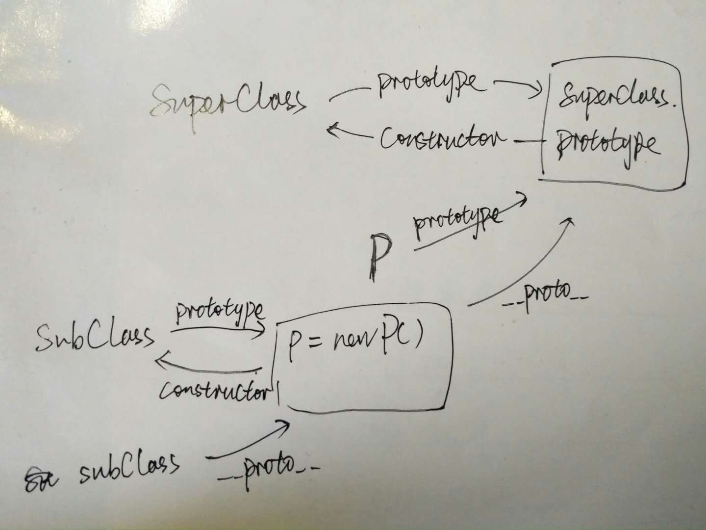

# **继承** 的小总结

- [**继承** 的小总结](#%E7%BB%A7%E6%89%BF-%E7%9A%84%E5%B0%8F%E6%80%BB%E7%BB%93)
  - [类式继承](#%E7%B1%BB%E5%BC%8F%E7%BB%A7%E6%89%BF)
    - [长这样子](#%E9%95%BF%E8%BF%99%E6%A0%B7%E5%AD%90)
    - [关于 instanceof](#%E5%85%B3%E4%BA%8E-instanceof)
    - [关于 `constructor`](#%E5%85%B3%E4%BA%8E-constructor)
    - [缺点](#%E7%BC%BA%E7%82%B9)
  - [构造函数继承](#%E6%9E%84%E9%80%A0%E5%87%BD%E6%95%B0%E7%BB%A7%E6%89%BF)
    - [长这样子](#%E9%95%BF%E8%BF%99%E6%A0%B7%E5%AD%90)
    - [缺点](#%E7%BC%BA%E7%82%B9)
  - [组合继承](#%E7%BB%84%E5%90%88%E7%BB%A7%E6%89%BF)
    - [长这样子的](#%E9%95%BF%E8%BF%99%E6%A0%B7%E5%AD%90%E7%9A%84)
    - [优缺点](#%E4%BC%98%E7%BC%BA%E7%82%B9)
  - [原型式继承](#%E5%8E%9F%E5%9E%8B%E5%BC%8F%E7%BB%A7%E6%89%BF)
  - [寄生式继承](#%E5%AF%84%E7%94%9F%E5%BC%8F%E7%BB%A7%E6%89%BF)
  - [寄生组合式继承](#%E5%AF%84%E7%94%9F%E7%BB%84%E5%90%88%E5%BC%8F%E7%BB%A7%E6%89%BF)
  - [附上完整代码](#%E9%99%84%E4%B8%8A%E5%AE%8C%E6%95%B4%E4%BB%A3%E7%A0%81)

---

## 类式继承

 ### 长这样子
  > 将父类的示例赋值给子类的原型

  ``` javascript
  // 父类
  function SuperClass() {
    this.value = true;
  }

  SuperClass.prototype.getSuperValue = function() {
    return this.value
  }

  function SubClass() {
    this.subValue = false
  }

  // 继承父类
  SubClass.prototype = new SuperClass()

  SubClass.prototyoe.getSubValue = function() {
    return this.subValue
  }

  // test
  var a = new SubClass()
  var b = new SubClass()
  console.log('a', a.getSuperValue())
  b.setSuperValue('123')
  console.log('b', b.getSuperValue())
  console.log('a', a.getSuperValue())

  // result
  a true
  b 123
  a true
  
  ```

 ### 关于 [instanceof](instanceof.md)

  > `obj instanceof Obj` : 运算符用来测试一个 **对象** 在其原型链中是否存在一个构造函数的 `prototype` 属性。即，检测 `constructor.prototype` 是否存在于参数 `Obj` 的原型链上

  ``` javascript
  var instance = new SubClass()

  instance instanceof SubClass   // true
  instance instanceof SuperClass // true

  // 值得注意：
  SubClass instanceof SuperClass // false
  SubClass.prototype instanceof SuperClass  // true
  ```

  为什么最后是 `false `和` true` 嘞？具体我们可以看下 [instanceof 的原理](instanceof.md)

 ### 关于 `constructor`
  > 返回一个指向创建了该对象原型的函数引用

  > 当创建一个函数或对象，都会为其创建一个原型对象 `prototype` ，在原型对象中又会创建一个 `constructor` 属性，指向 **拥有整个原型对象的函数或对象**

  在以上例子中： 
  ``` javascript

  SubClass.prototype.constructor 
  // 结果并不是SubClass，而是SuperClass
  function SuperClass() {
    this.value = true;
  }

  // 再添加一个类继承 SubClass
  function Sub2() {
    this.a = 1
  }

  Sub2.prototype = new SubClass()
  console.log(Sub2.prototype.constructor)

  // 结果仍是SuperClass
  function SuperClass() {
    this.value = true;
  }

  ```

 ### 缺点

  - **引用类型被共用 （数组，对象，函数）**
    ``` JavaScript
    // 父类中有引用类型的变量books（Array）
    function SuperClass() {
        this.books = ['js', 'css']
    }
    // 类式继承
    function SubClass() {}
    SubClass.prototype = new SuperClass()
    // 俩子类实例
    var instance1 = new SubClass()
    var instance2 = new SubClass()

    instance1.books.push('html')
    console.log(instance2.books) // ['js', 'css', 'html']

    // 在实例1中对books进行修改，造成了实例2被修改
    ```
  - **无法向父类传参数**

---

## 构造函数继承

 ### 长这样子

  ``` javascript
  function Sup(id) {
    this.books = ['JS', 'CSS']
    this.id = id
  }

  Sup.prototype.showBooks = function() {
    return this.books
  }

  function Sub(id) {
    // 继承Sup类
    Sup.call(this, id)
  }

  var instance1 = new Sub(10)
  var instance2 = new Sub(11)

  console.log(instance1.id)   // 10
  console.log(instance2.id)   // 11

  instance1.books.push('HTML')
  console.log(instance1.books)    // ['JS', 'CSS', 'HTML']
  console.log(instance2.books)    // ['JS', 'CSS']
  ```
  `Sup.call(this, id)` 改变函数的作用环境，相当于将父类在子类中执行一遍，由于在执行父类时， `this` 是绑定到子类，所以子类便继承了父类的共有属性

 ### 缺点

  此种方式解决了类式继承的主要缺点，但也有自己的缺点

  - 没有涉及到 `prototype` 的继承，所以父类的原型方法自然不会被子类继承，如果想被子类继承就必须要放在构造函数中，这样创建的实例都会 独立拥有一份而不能共用

  ``` javascript
  // 对上面例子，showBooks 是加在Sup的原型上的，所以不能被继承
  instance1.showBooks()
  > Uncaught TypeError: instance1.showBooks is not a function
  ```

---

## 组合继承

 ### 长这样子的

  回顾下以上两种

  - **类式继承**： 通过子类的 `prototype` 对父类实例化来实现继承  

  - **构造函数继承**： 通过在子类的构造函数作用环境中执行父类的构造函数来实现继承

  组合两种即为 **组合继承**

  ``` javascript

    // 父类
    function SuperClass(id) {
      // 值类型共有属性
      this.id = id
      // 引用类型
      this.books = ['JS', 'CSS']
    }

    // 父类原型共有方法
    SuperClass.prototype.getId = function() {
      return this.id
    }

    // 子类
    function SubClass(id, name) {
      // 构造函数式 继承父类
      SuperClass.call(this, id)
      this.name = name
    }

    // 类式继承 子类原型继承父类
    SubClass.prototype = new SuperClass()

    // 子类原型方法
    SubClass.prototype.getName = function() {
      return this.name
    }
  
  ```

 ### 优缺点

  - **优点**：融合了类式继承和构造器继承的优点，并消除两者的缺点
  - **缺点**：父类构造函数调用了两次

    - 构造函数继承时调用了一次
    - 实现子类原型的类式继承时又调用了一次

    哪来那么多要求 😑，那我们看下一个

---

## 原型式继承

  > **原型式继承** 是对类式继承的一个封装， 其中的过渡对象就相当于类式继承中的子类，只不过在原型中作为一个过渡对象出现，目的是 为了创建要返回的新的实例化对象

  ``` javascript
  // 原型式继承
  function inheritObject(o) {
      // 声明一个过渡函数对象
      function F() {}
      // 过渡对象的原型继承父对象
      F.prototype = o
      // 返回过渡对象的一个实例， 该实例的原型继承了父对象
      return new F()
  }
  ```

  但是噢，跟类式继承一样，父类对象book中的 **值类型的属性被复制， 引用类型的属性被共用**

  ``` javascript
    var book = {
      name: 'js',
      alike: ['css', 'html']
    }

    var newBook = inheritObject(book)
    newBook.name = 'nodeJs'
    newBook.alike.push('nodeJs')

    var otherBook = inheritObject(book)
    otherBook.name = 'ajax'
    otherBook.alike.push('ajax')

    newBook.name    // nodeJs
    newBook.alike   // ['css', 'html', 'nodeJs', 'ajax']

    otherBook.name  // ajax
    otherBook.alike // ['css', 'html', 'nodeJs', 'ajax']

    book.name       // js
    book.alike      // ['css', 'html', 'nodeJs', 'ajax']

    // 注意这里

    newBook.__proto__ === book  // true
  ```
  
---

## 寄生式继承

  > 新对象 **寄托** 于某个对象内部生长，所以 “寄生”

  ``` javascript
    // 声明基对象
    var book = {
      name: 'js',
      alike: ['css', 'html']
    }

    function createBook(obj) {
      // 通过原型继承方式创建新对象
      var o = new inheritObject(obj)
      // 拓展 ！！
      o.getName = function() {
        console.log(this.name)
      }
      return o
    }

    // test
    var newBook = createBook(book)
    newBook.name            // "js"
    newBook.name = '12'

    // 使用拓展方法
    newBook.getName()       // '12'
    newBook.alike.push('123')

    // book 的引用类型被修改
    book.alike              // ["css", "html", "123"]

  ```

---

## 寄生组合式继承

  回顾下 **组合式继承**： 类式 + 构造式
  
  它的问题之一： 子类不是父类的实例，而子类的原型是父类的实例

  **寄生组合式继承**： 寄生式 + 构造函数式

  ``` javascript
    /**
    * 寄生式继承 继承原型
    * 处理的不是对象，而是类的原型
    * @param subClass      子类
    * @param superClass    父类
    **/
    function inheritPrototype(subClass, superClass) {
      // 复制一份父类的原型副本保存在p中
      var p = inheritObject(superClass.prototype)
      
      // 修正因为重写子类原型导致子类的constructor属性被修改
      p.constructor = subClass
      
      // 设置子类的原型
      subClass.prototype = p
    }
  ```

  关于该函数：

  - 通过 **构造函数继承** 的属性&方法是没有的， 所以在这里我们需要的是通过 **寄生式继承** 重新继承父类的**原型** (继承的是 **原型** 哦)

  - 但是，直接赋值给子类会有问题，因为对父类原型对象复制得到的复制对象 `p` 中的 `constructor` 指向的不是 `subClass` 子类对象.
  - 因此，需要在寄生式继承中对`p`做一次增强，修复其 `constructor` 属性指向不正确的问题.
  - 最后再将 `p` 赋值给子类的原型，这样子类的原型就继承了父类的原型并且没有执行父类的构造函数

  所以，相比组合式继承，也只是在一个地方做了修改，即 **子类原型继承父类原型** 这一处

  ``` javascript
  // 定义父类
  function SuperClass(name) {
    this.name = name
    this.color = ['red', 'black']
  }
  // 父类原型方法
  SuperClass.prototype.getName = function() {
    return this.name
  }

  // 定义子类
  function SubClass(name, time) {
    // 构造函数式继承
    SuperClass.call(this, name)
    // 子类新增属性
    this.time = time
  }

  // 寄生式继承父类原型
  inheritPrototype(SubClass, SuperClass)

  // 子类新增方法
  SubClass.prototype.getTime = function() {
    return this.time
  }

  --------------------------------------------------
  // test

  var instance1 = new SubClass('js', 2014)
  var instance2 = new SubClass('css', 2013)

  instance1.colors.push('green')
  instance1.colors                // ['red', 'black', 'green]
  instance2.colors                // ['red', 'black']


  SubClass.prototype instanceof SuperClass    // true
  SubClass instanceof SuperClass              // false


  // 原型 constructor
  instance1.__proto__.constructor
  // result
  >>  function SubClass(name, time) {
        // 构造函数式继承
        SuperClass.call(this, name);
        // 子类新增属性
        this.time = time;
      }
    
  
  SubClass.prototype 
  打印结果为 =>>
    SuperClass
      {
        constructor： SubClass(name, time),
        getTime: (),
        __proto__: {
          constructor: SuperClass(name),
          getName: (),
          __proto__: Object
        }
      }

  如果修改：
  SubClass.prototype.__proto__.constructor = SubClass

  则：
  SubClass.prototype
  打印结果为 =>> 
    SubClass
  ```

  图示可以看下本手残党的图：
  

## 附上完整代码

``` javascript

/**
 * 原型式继承
 * @param o     继承对象
 **/
function inheritObject(o) {
  // 声明一个过渡函数对象
  function F() {}
  // 过渡对象的原型继承父对象
  F.prototype = o
  // 返回过渡对象的一个实例， 该实例的原型继承了父对象
  return new F()
}

/**
 * 寄生式继承 继承原型
 * 处理的不是对象，而是类的原型
 * @param subClass      子类
 * @param superClass    父类
 **/
function inheritPrototype(subClass, superClass) {
  // 复制一份父类的原型副本保存在p中
  var p = inheritObject(superClass.prototype)
  
  // 修正因为重写子类原型导致子类的constructor属性被修改
  p.constructor = subClass
  
  // 设置子类的原型
  subClass.prototype = p
}

// 使用例子： 

// 定义父类
function SuperClass(name) {
  this.name = name
  this.color = ['red', 'black']
}
// 父类原型方法
SuperClass.prototype.getName = function() {
  return this.name
}

// 定义子类
function SubClass(name, time) {
  // 构造函数式继承
  SuperClass.call(this, name)
  // 子类新增属性
  this.time = time
}

// 寄生式继承父类原型
inheritPrototype(SubClass, SuperClass)

// 子类新增方法
SubClass.prototype.getTime = function() {
  return this.time
}

```