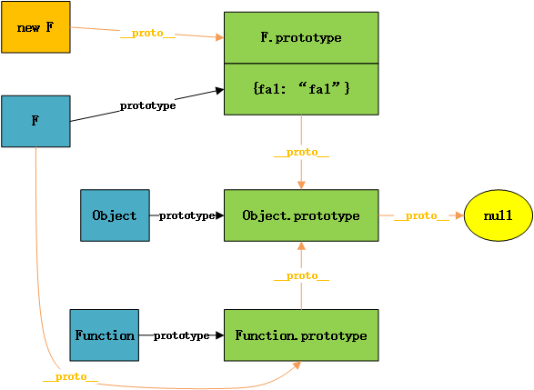

# `new`关键字

## `new` 的过程
使用 `new` 时，会发生以下：

``` javascript

function Person() { 
  this.name = 'name'
} 

var person = new Person() 

// 1：创建一个空对象obj 
var obj = {} 

// 2：设置obj的__proto__为原型 
obj.__proto__ = Person.prototype; 

// 3：使用obj作为上下文调用Person函数 
var ret = Person.call(obj); 

// 4：如果构造函数返回的是原始值，那么这个返回值会被忽略, 如果构造函数返回的是对象，就会覆盖构造的实例 
if (typeof ret == 'object') {
  return ret; 
} else { 
  return obj 
}

```

## 不加 `new` 会怎么样？

使用`new`的时候如果忘了`new`关键词，会引发一些问题。

最重要的问题就是影响了原型查找，原型查找是沿着`__proto__`进行的，**而任何函数都 `Function` 的实例**，一旦没使用 `new` ，你就会发现什么属性都查不到了，因为相当于直接短路了。如下面的例子所示，没有使用`new`来创建对象的话，就无法找到原型上的`fa1`属性了：

``` javascript

function F(){ } 

F.prototype.fa1 = "fa1"; 

console.log(F.fa1); // undefined
console.log(new F().fa1); // fa1

```



### 防止忘记加 `new` 的方法

``` javascript

function Foo(){ 
  // 如果忘了使用关键字，这一步骤会悄悄帮你修复这个问题 
  if ( !(this instanceof Foo) ) 
    return new Foo(); 
  
  // 构造函数的逻辑继续…… 
}

```