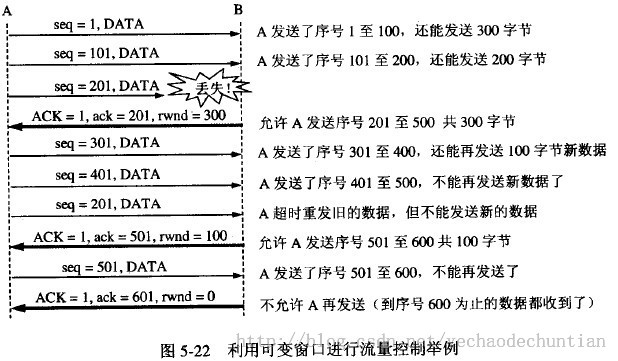

- [TCP](#tcp)
- [TCP的连接和释放](#tcp%E7%9A%84%E8%BF%9E%E6%8E%A5%E5%92%8C%E9%87%8A%E6%94%BE)
  - [TCP标志位](#tcp%E6%A0%87%E5%BF%97%E4%BD%8D)
  - [过程](#%E8%BF%87%E7%A8%8B)
    - [三次握手](#%E4%B8%89%E6%AC%A1%E6%8F%A1%E6%89%8B)
      - [为什么要三次握手？](#%E4%B8%BA%E4%BB%80%E4%B9%88%E8%A6%81%E4%B8%89%E6%AC%A1%E6%8F%A1%E6%89%8B%EF%BC%9F)
    - [四次挥手](#%E5%9B%9B%E6%AC%A1%E6%8C%A5%E6%89%8B)
      - [为什么要四次分手？](#%E4%B8%BA%E4%BB%80%E4%B9%88%E8%A6%81%E5%9B%9B%E6%AC%A1%E5%88%86%E6%89%8B%EF%BC%9F)
      - [为什么要等待2MSL？](#%E4%B8%BA%E4%BB%80%E4%B9%88%E8%A6%81%E7%AD%89%E5%BE%852msl%EF%BC%9F)
- [拥塞控制](#%E6%8B%A5%E5%A1%9E%E6%8E%A7%E5%88%B6)
- [流量控制](#%E6%B5%81%E9%87%8F%E6%8E%A7%E5%88%B6)
- [UDP VS TCP](#udp-vs-tcp)
- [参考](#%E5%8F%82%E8%80%83)

---
# TCP 

> TCP，传输控制协议(Transmission Control Protocol)，是 TCP/IP 模型**运输层**中的其中一种协议

- TCP 提供一种**面向连接**的、**可靠的字节流**服务
- 在一个 TCP 连接中，仅有**两方**进行彼此通信。广播和多播不能用于 TCP
- TCP 使用**校验和**，**确认**和**重传机制**来保证可靠传输
- TCP 给数据分节进行排序，并使用累积确认保证数据的顺序不变和非重复
- TCP 使用**滑动窗口**机制来实现**流量控制**，通过**动态改变窗口**的大小进行**拥塞控制**

# TCP的连接和释放

> TCP传输控制协议，是一个面向连接的协议。在运用此协议进行数据传输前都会进行连接的建立工作（三次握手）；当数据传输完毕，连接的双方都会通知对方要释放此连接（四次挥手）。

## TCP标志位

  | 标志 | 说明                 |
  | ---- | --------------------|
  | SYN  | synchronous建立联机  |
  | ACK  | acknowledgement 确认 |
  | PSH  | push传送             |
  | FIN  | finish结束           |
  | RST  | reset重置            |
  | URG  | urgent紧急           |

## 过程

  

### 三次握手
  
  三次握手的目的是连接服务器指定端口，建立 TCP 连接，并同步连接双方的序列号和确认号，交换 TCP 窗口大小信息。在 socket 编程中，客户端执行 connect() 时。将触发三次握手。

  - 第一次握手 (SYN=1, seq=**x**)：
    
    客户端发送一个 **TCP 标志位** `SYN=1，ACK=0` 的数据包给服务端，并随机会产生一个**序列号**` Sequence number = 3233`.当服务端接收到这个数据后，服务端由 `SYN=1` 可知客户端是想要建立连接；

    发送完毕后，客户端进入 `SYN_SEND` 状态。
    
  - 第二次握手(SYN=1, ACK=1, seq=**y**, ACKnum=**x**+1)

    服务端要对客户端的联机请求进行确认，向客户端发送应答号 `ACK=1、SYN=1`
    确认号 `Acknowledge number = 3234` ，此值是**客户端的序列号加 1** ，还会产生一个随机的序列号 `Sequence number= 36457 `，这样就告诉客户端可以进行连接；

    发送完毕后，服务器端进入 `SYN_RCVD` 状态。

  - 第三次握手(ACK=1，ACKnum=**y**+1)
  
    客户端收到数据后检查 `Acknowledge number` 是否是 `3233 + 1` 的值，以及 ACK 的值是否为 1，若为 1，host1 会发送 `ACK=1`、确认号码 `Acknowledge number=36458`，告诉服务端,你的请求连接被确认，连接可以建立。

    发送完毕后，客户端进入 `ESTABLISHED` 状态，当服务器端接收到这个包时，也进入 `ESTABLISHED` 状态，TCP 握手结束。

 #### 为什么要三次握手？

  为了防止已失效的连接请求报文段突然又传送到了服务端，因而产生错误。

  具体例子：“**已失效的连接请求报文段**”的产生在这样一种情况下：client发出的第一个连接请求报文段并没有丢失，而是在某个网络结点长时间的滞留了，以致延误到连接释放以后的某个时间才到达server。本来这是一个早已失效的报文段。但server收到此失效的连接请求报文段后，就误认为是client再次发出的一个新的连接请求。于是就向client发出确认报文段，同意建立连接。假设不采用“三次握手”，那么只要server发出确认，新的连接就建立了。由于现在client并没有发出建立连接的请求，因此不会理睬server的确认，也不会向server发送数据。但server却以为新的运输连接已经建立，并一直等待client发来数据。这样，server的很多资源就白白浪费掉了。采用“三次握手”的办法可以防止上述现象发生。例如刚才那种情况，client不会向server的确认发出确认。server由于收不到确认，就知道client并没有要求建立连接。”
  
---
### 四次挥手

  **客户端或服务器均可主动发起挥手动作**，在 socket 编程中，任何一方执行 close() 操作即可产生挥手操作。
  
  - 第一次挥手(FIN=1，seq=x)
  
    当传输的数据到达尾部时，客户端向服务端发送 `FIN=1` 标志位；可理解成，客户端向服务端说，我这边的数据传送完成了，我准备断开了连接；

    发送完毕后，客户端进入 `FIN_WAIT_1` 状态。

  - 第二次挥手(ACK=1，ACKnum=x+1)

    因 TCP 的连接是 **全双工的双向连接**，关闭也是要从两边关闭；当服务端收到客户端发来的 `FIN=1` 的标志位后，服务端**不会立刻**向客户端发送 `FIN=1` 的请求关闭信息，而是先向客户端发送一个 `ACK=1` 的应答信息，表示：你请求关闭的请求我已经收到，但我可能还有数据没有完成传送，你再等下，等我数据传输完成了我就告诉你；

    发送完毕后，服务器端进入 `CLOSE_WAIT` 状态，客户端接收到这个确认包之后，进入 `FIN_WAIT_2` 状态，等待服务器端关闭连接。
    
  - 第三次挥手(FIN=1，seq=y)
  
    服务端数据传输完成，向客户端发送 `FIN=1` ，客户端收到请求关闭连接的请求后，客户端就明白服务端的数据已传输完成，现在可以断开连接了

    发送完毕后，服务器端进入 `LAST_ACK` 状态，等待来自客户端的最后一个`ACK`。

  - 第四次挥手(ACK=1，ACKnum=y+1)

    客户端接收到来自服务器端的关闭请求，发送一个确认包，并进入 `TIME_WAIT` 状态，等待可能出现的要求重传的 `ACK` 包。

    服务器端接收到这个确认包之后，关闭连接，进入 `CLOSED` 状态。

    客户端等待了某个固定时间（**两个最大段生命周期**，2MSL，2 Maximum Segment Lifetime）之后，没有收到服务器端的 ACK ，认为服务器端已经正常关闭连接，于是自己也关闭连接，进入 `CLOSED` 状态。

 #### 为什么要四次分手？
  TCP协议是一种面向连接的、可靠的、基于字节流的运输层通信协议。TCP是全双工模式，这就意味着，当主机1发出FIN报文段时，只是表示主机1已经没有数据要发送了，主机1告诉主机2，它的数据已经全部发送完毕了；但是，这个时候主机1还是可以接受来自主机2的数据；当主机2返回ACK报文段时，表示它已经知道主机1没有数据发送了，但是主机2还是可以发送数据到主机1的；当主机2也发送了FIN报文段时，这个时候就表示主机2也没有数据要发送了，就会告诉主机1，我也没有数据要发送了，之后彼此就会愉快的中断这次TCP连接。

 #### 为什么要等待2MSL？

  MSL：报文段最大生存时间，它是任何报文段被丢弃前在网络内的最长时间。原因有二：

  - 保证TCP协议的全双工连接能够可靠关闭
  - 保证这次连接的重复数据段从网络中消失

  - 第一点：如果主机1直接CLOSED了，那么由于IP协议的不可靠性或者是其它网络原因，导致主机2没有收到主机1最后回复的ACK。那么主机2就会在超时之后继续发送FIN，此时由于主机1已经CLOSED了，就找不到与重发的FIN对应的连接。所以，主机1不是直接进入CLOSED，而是要保持TIME_WAIT，当再次收到FIN的时候，能够保证对方收到ACK，最后正确的关闭连接。
  - 第二点：如果主机1直接CLOSED，然后又再向主机2发起一个新连接，我们不能保证这个新连接与刚关闭的连接的端口号是不同的。也就是说有可能新连接和老连接的端口号是相同的。一般来说不会发生什么问题，但是还是有特殊情况出现：假设新连接和已经关闭的老连接端口号是一样的，如果前一次连接的某些数据仍然滞留在网络中，这些延迟数据在建立新连接之后才到达主机2，由于新连接和老连接的端口号是一样的，TCP协议就认为那个延迟的数据是属于新连接的，这样就和真正的新连接的数据包发生混淆了。所以TCP连接还要在TIME_WAIT状态等待2倍MSL，这样可以保证本次连接的所有数据都从网络中消失。

---
# 拥塞控制

> 在某段时间，若对网络中某资源的需求超过了该资源所能提供的可用部分，网络的性能就要变坏。拥塞控制防止过多的数据注入到网络中，这样可以使网络中的路由器或链路不致过载。

- 慢开始

  在主机刚刚开始发送报文段时可先将拥塞窗口 cwnd 设置为一个**最大报文段 MSS** 的数值。在每收到一个对新的报文段的确认后，将拥塞窗口增加至多一个 MSS 的数值。用这样的方法逐步**增大发送端的拥塞窗口 cwnd**，可以使分组注入到网络的速率更加合理。每经过一个传输轮回，拥塞窗口(发送端)就加倍。

- 拥塞避免
  
  让拥塞窗口缓慢增大，每经过一个往返时间就加1，而不是加倍，按线性规律缓慢增长。**拥塞窗口大于慢开始门限 ssthresh，就执行拥塞避免算法**。
  - 乘法减小：指不论在慢开始还是拥塞避免阶段，只要出现ssthresh就把慢开始门限值减半。
  - 加法增大:指执行拥塞避免算法后，使拥塞窗口缓慢增大，以防止网络过早出现拥塞
  - 合起来叫AIMD算法。

  “拥塞避免” 是说在拥塞避免阶段将拥塞窗口控制为按线性规律增长，使网络比较不容易出现拥塞

- 快重传算法
  
  快重传算法首先要求**接收方**每收到一个**失序**的报文段后就立即发出**重复确认**（为的是使发送方及早知道有报文段没有到达对方）
  
  **发送方**只要**一连收到三个重复确认**就应当重传对方尚未收到的报文。而不必等到该分组的重传计时器到期。

- 快恢复算法

  - (1) 当发送端收到连续三个重复的确认时，就执行“乘法减小”算法，把慢开始门限 ssthresh 减半。但接下去**不执行慢开始算法**。
  - (2) 由于发送方现在认为网络很可能没有发生拥塞，因此现在不执行慢开始算法，即拥塞窗口 cwnd 现在不设置为 1，而是设置为慢开始门限 ssthresh 减半后的数值，然后开始执行拥塞避免算法（“加法增大”），使拥塞窗口缓慢地线性增大.

# 流量控制

> **流量控制**: 指的是**点对点通信量的控制，是个端到端的问题**。流量控制所要做的就是**控制发送端发送数据的速率**，以便使接收端来得及接受。

利用**滑动窗口机制**可以很方便地在TCP连接上实现对发送方的流量控制。

设A向B发送数据。在建立连接时，B告诉A：“我的接收窗口rwnd=400”。因此发送方的发送窗口不能超过接收方给出的接收窗口的数值。再设每一个报文段为100字节长，而数据报文段序号的初始值设为1。（大写ACK表示首部中的确认位ACK，小写ack表示确认字段的值）

# UDP VS TCP

UDP 是一个简单的传输层协议。和 TCP 相比，UDP 有下面几个显著特性：

- **TCP 提供可靠交付**(无差错、不丢失、不重复、并且按序到达)，**UDP 使用尽最大努力交付**。

  UDP 缺乏可靠性。UDP 本身不提供确认，序列号，超时重传等机制。UDP 数据报可能在网络中被复制，被重新排序。即 UDP 不保证数据报会到达其最终目的地，也不保证各个数据报的先后顺序，也不保证每个数据报只到达一次

- **TCP 面向字节流，而 UDP 是面向报文的**。

  UDP 数据报是有长度的。每个 UDP 数据报都有长度，如果一个数据报正确地到达目的地，那么该数据报的长度将随数据一起传递给接收方。而 TCP 是一个字节流协议，没有任何（协议上的）记录边界。

- **UDP 是无连接的, 而 TCP 面向连接**
  
  UDP 客户和服务器之前不必存在长期的关系。UDP 发送数据报之前也不需要经过握手创建连接的过程。

- **TCP 连接只能是一对一， UDP 支持多播和广播**

- **TCP 有拥塞控制，而 UDP 没有拥塞控制**

---
# 参考

- [TCP的拥塞控制](https://zhangbinalan.gitbooks.io/protocol/content/tcpde_yong_sai_kong_zhi.html)
- [TCP的流量控制 和 拥塞控制](https://www.jianshu.com/p/bd141e76bc8b)