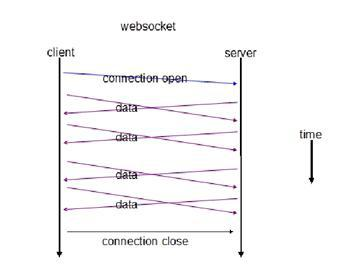

# WebSocket

> WebSocket 是 HTML5 下一种新的协议。它实现了 **浏览器与服务器全双工通信**，能更好的节省服务器资源和带宽并达到实时通讯的目的。

它与HTTP一样通过已建立的TCP连接来传输数据，但是它和HTTP最大不同是：

WebSocket 是一种双向通信协议。在建立连接后，WebSocket服务器端和客户端都能主动向对方发送或接收数据，就像Socket一样；

WebSocket 连接建立后，后续数据都以**帧序列**的形式传输。在客户端断开 WebSocket 连接或 Server 端中断连接前，不需要客户端和服务端重新发起连接请求



# WS VS HTTP

相比HTTP长连接，WebSocket有以下特点：

- **全双工**方式，建立连接后客户端与服务器端是完全平等的，可以互相主动请求。而HTTP长连接基于HTTP，是传统的客户端对服务器发起请求的模式。
- HTTP长连接中，每次数据交换除了真正的数据部分外，服务器和客户端还要大量交换 HTTP header ，信息交换效率很低。Websocket协议通过第一个 request 建立了 TCP 连接之后，**之后交换的数据都不需要发送  HTTP header 就能交换数据**，这显然和原有的HTTP协议有区别所以它需要对服务器和客户端都进行升级才能实现（主流浏览器都已支持HTML5）。
- 此外还有 multiplexing、不同的URL可以复用同一个WebSocket连接等功能。这些都是HTTP长连接不能做到的。

报文上的不同：

WebSocket 复用了 HTTP 的握手通道。具体指的是，客户端通过 HTTP 请求与 WebSocket服务端**协商升级协议**。协议升级完成后，后续的数据交换则遵照WebSocket的协议。

- 1、客户端：申请协议升级

  ``` javascript
  GET / HTTP/1.1
  Host: localhost:8080
  Origin: http://127.0.0.1:3000
  Connection: Upgrade
  Upgrade: websocket
  Sec-WebSocket-Version: 13
  Sec-WebSocket-Key: w4v7O6xFTi36lq3RNcgctw==
  ... 省略
  ```
  - Connection: Upgrade：表示要升级协议
  - Upgrade: websocket：表示要升级到websocket协议。
  - Sec-WebSocket-Version: 13：表示websocket的版本。
  - Sec-WebSocket-Key：与后面服务端响应首部的 Sec-WebSocket-Accept是配套的，提供基本的防护，比如恶意的连接，或者无意的连接。

- 2、服务端：响应协议升级

  ``` javascript
  HTTP/1.1 101 Switching Protocols
  Upgrade: websocket
  Connection: Upgrade
  Sec-WebSocket-Accept: K7DJLdLooIwIG/MOpvWFB3y3FE8=
  ```
  `Sec-WebSocket-Accept` 的值是服务端采用与客户端一致的密钥计算出来后返回客户端的，`HTTP/1.1 101 Switching Protocols` 表示服务端接受 WebSocket 协议的客户端连接，经过这样的请求-响应处理后，两端的 WebSocket 连接握手成功, 后续就可以进行TCP通讯了

# 参考

- [WebSocket原理说明](https://cloud.tencent.com/document/product/214/4150?fromSource=gwzcw.93403.93403.93403)
- [WebSocket协议深入探究 (包含实现！！)](http://www.infoq.com/cn/articles/deep-in-websocket-protocol)