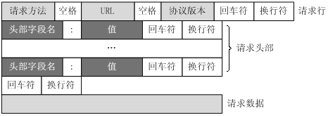

# HTTP

- [HTTP](#http)
  - [简介](#%E7%AE%80%E4%BB%8B)
  - [主要特点](#%E4%B8%BB%E8%A6%81%E7%89%B9%E7%82%B9)
  - [请求消息 和 响应消息](#%E8%AF%B7%E6%B1%82%E6%B6%88%E6%81%AF-%E5%92%8C-%E5%93%8D%E5%BA%94%E6%B6%88%E6%81%AF)
  - [状态码](#%E7%8A%B6%E6%80%81%E7%A0%81)
  - [HTTP请求方法](#http%E8%AF%B7%E6%B1%82%E6%96%B9%E6%B3%95)
    - [`GET` VS `POST`](#get-vs-post)
  - [HTTP 1.1 VS HTTP 1.0](#http-11-vs-http-10)
  - [HTTP vs HTTPS](#http-vs-https)
  - [URI & URL & URN](#uri-url-urn)
  - [参考](#%E5%8F%82%E8%80%83)

---
## 简介

 - HTTP 协议是 Hyper Text Transfer Protocol（超文本传输协议）的缩写,是用于从万维网（WWW:World Wide Web ）服务器传输超文本到本地浏览器的传送协议。
 - HTTP 基于 **TCP/IP** 通信协议来传递数据
 - 属于**应用层**的面向对象的协议
 - 工作于**客户端-服务端**架构为上。浏览器作为HTTP客户端通过URL向HTTP服务端即WEB服务器发送所有请求。Web服务器根据接收到的请求后，向客户端发送响应信息。

---
## 主要特点

  - 简单快速
    
    客户向服务器请求服务时，只需**传送请求方法和路径**。请求方法常用的有GET、HEAD、POST。每种方法规定了客户与服务器联系的类型不同。由于HTTP协议简单，使得HTTP服务器的程序规模小，因而通信速度很快。
    
  - 灵活

    HTTP允许传输任意类型的数据对象。正在传输的类型由 `Content-Type` 加以标记。
  
  - 无连接

    限制每次连接只处理一个请求。服务器处理完客户的请求，并收到客户的应答后，即断开连接。采用这种方式可以节省传输时间。

  - 无状态

    HTTP协议是**无状态协议**。无状态是指协议对于事务处理没有记忆能力。缺少状态意味着如果后续处理需要前面的信息，则它必须重传，这样可能导致每次连接传送的数据量增大。另一方面，在服务器不需要先前信息时它的应答就较快。

    因此也引入了 Cookie

  - 支持 C/S 和 B/S 模式

---
## 请求消息 和 响应消息
  - **请求消息 request**

    组成：
    - 请求行： 请求方法、请求URL、HTTP版本
    - 请求头部
    - 空行
    - 请求数据

    

  - **响应消息 Response**

    组成：
    - 状态行： 版本号、状态码、状态消息
    - 消息报头
    - 空行
    - 响应正文
    
    

---
## 状态码

  - 1xx：指示信息--表示请求已接收，继续处理
  - 2xx：成功--表示请求已被成功接收、理解、接受
  - 3xx：重定向--要完成请求必须进行更进一步的操作
  - 4xx：客户端错误--请求有语法错误或请求无法实现
  - 5xx：服务器端错误--服务器未能实现合法的请求

  | code | 状态信息              | 含义                                                                                                                                                                                                                                                                                                                           |
  | -------- | --------------------- | ------------------------------------------------------------------------------------------------------------------------------------------------------------------------------------------------------------------------------------------------------------------------------------------------------------------------------ |
  | 100      | Continue              | 初始的请求已经接受，客户应当继续发送请求的其余部分。（HTTP 1.1新）                                                                                                                                                                                                                                                             |
  | 101      | Switching Protocols   | 服务器将遵从客户的请求转换到另外一种协议（HTTP 1.1新）                                                                                                                                                                                                                                                                         |
  | **200**      | OK                    | 一切正常，对GET和POST请求的应答文档跟在后面。                                                                                                                                                                                                                                                                                  |
  | 202      | Accepted              | 已经接受请求，但处理尚未完成。                                                                                                                                                                                                                                                                                                 |
  | 204      | No Content            | 没有新文档，浏览器应该继续显示原来的文档。如果用户定期地刷新页面，而服务器可确定文档足够新，用204。                                                                                                                                                                                                                            |
  | **206**      | Partial Content       | 客户发送了一个带有 `Range` 头的 GET 请求，服务器完成了它（HTTP 1.1新）。                                                                                                                                                                                                                                                       |
  | **301**      | Moved Permanently     | 客户请求的文档在其他地方，新的URL在Location头中给出，浏览器应该自动地访问新的URL。                                                                                                                                                                                                                                             |
  | **302**      | Found                 | 类似于 301，但新的URL应该被视为**临时性的替代**，而不是永久性的。                                                                                                                                                                                                                                                              |
  | 303      | See Other             | 类似于301/302，不同于，如果原来的请求是POST，Location头指定的重定向目标文档应该通过GET提取（HTTP 1.1新）。                                                                                                                                                                                                                     |
  | **304**      | Not Modified          | 客户端有缓冲的文档并发出了一个条件性的请求。服务器告诉客户，原来缓冲的文档还可以继续使用。                                                                                                                                                                                                                                     |
  | 307      | Temporary Redirect    | 和302（Found）相同。许多浏览器会错误地响应302应答进行重定向，即使原来的请求是POST，即使它实际上只能在POST请求的应答是303时 才能重定向。由于这个原因，HTTP 1.1新增了307，以便更加清除地区分几个状态代码：当出现303应答时，浏览器可以跟随重定向的GET和POST请求；如果是307应答，则浏览器只能跟随对GET请求的重定向。（HTTP 1.1新） |
  | **400**      | Bad Request           | 请求出现语法错误。                                                                                                                                                                                                                                                                                                             |
  | **401**      | Unauthorized          | 客户试图未经**授权**访问受密码保护的页面。                                                                                                                                                                                                                                                                                     |
  | 403      | Forbidden             | 资源不可用。服务器理解客户的请求，但拒绝处理它。通常由于服务器上文件或目录的权限设置导致。                                                                                                                                                                                                                                     |
  | **404**      | Not Found             | 无法找到指定位置的资源。这也是一个常用的应答。                                                                                                                                                                                                                                                                                 |
  | 405      | Method Not Allowed    | 请求方法对指定的资源不适用。（HTTP 1.1新）                                                                                                                                                                                                                                                                                     |
  | **500**      | Internal Server Error | 服务器遇到了意料不到的情况，不能完成客户的请求。                                                                                                                                                                                                                                                                               |
  | 502      | Bad Gateway           | 服务器作为网关或者代理时，为了完成请求访问下一个服务器，但该服务器返回了非法的应答。                                                                                                                                                                                                                                           |
  | 503      | Service Unavailable   | 服务器由于维护或者负载过重未能应答。例如，可能在数据库连接池已满的情况下返回503。                                                                                                                                                                                                                                              |
  | 504      | Gateway Timeout       | 由作为代理或网关的服务器使用，表示不能及时地从远程服务器获得应答。（HTTP 1.1新）                                                                                                                                                                                                                                               |

---

## HTTP请求方法

  HTTP 1.0 定义了三种请求方法： GET, POST 和 HEAD方法。

  HTTP 1.1 新增了五种请求方法：OPTIONS, PUT, DELETE, TRACE 和 CONNECT 方法。

  | 请求方法 | 功能                                                                         |
  | -------- | ----------------------------------------------------------------------------|
  | GET      | 请求指定的页面信息，并返回实体主体。                                           |
  | HEAD     | 返回的响应中没有具体的内容，用于获取报头                                       |
  | POST     | 向指定资源提交数据进行处理请求（例如提交表单或者上传文件）。数据被包含在请求体中。 |
  | PUT      | 从客户端向服务器传送的数据取代指定的文档的内容。                                |
  | DELETE   | 请求服务器删除指定的页面。                                                    |
  | CONNECT  | HTTP/1.1协议中预留给能够将连接改为管道方式的代理服务器。                        |
  | OPTIONS  | 允许客户端查看服务器的性能。                                                  |
  | TRACE    | 回显服务器收到的请求，主要用于测试或诊断。                                     |

 ### `GET` VS `POST`

  - 提交姿势 

    `GET` 提交的数据会放在 URL 之后，以`?`分割 URL 和传输数据，参数之间以&相连，如 `EditPosts.aspx?name=test1&id=123456`
    
    `POST` 方法是把提交的数据放在HTTP包的Body中.
  
  - 传输数据的大小

    > 首先声明：HTTP 协议没有对传输的数据大小进行限制，HTTP 协议规范也没有对 URL 长度进行限制

    - `GET`: 特定浏览器和服务器对 URL 长度有限制, 因此对于 GET 提交时，传输数据就会受到 URL 长度的限制
    - `POST`: 由于不是通过 URL 传值，理论上数据不受限。但实际各个WEB服务器会规定对提交数据大小进行限制

  - POST 的安全性要比 GET 的安全性高
  - GET 方式需要使用 `Request.QueryString` 来取得变量的值，而POST方式通过 `Request.Form` 来获取变量的值

---
## HTTP 1.1 VS HTTP 1.0

  - 长连接

    在 HTTP 1.0 中, 如果客户端请求头没有设置 `Connection: Keep-Alive` 的话, 那么每次请求完成都会立即断开连接, 然后客户端又要重新建立一个HTTP连接.

    在 HTTP 1.1 中, keep-Alive 已经被弃用(但是大多数服务器和浏览器都还保留这个选项). **持久连接默认就是启用的**, 除非你显式在响应头部包含 `Connection: close` , 客户端收到响应后才会关闭连接.

  - host头域

    HTTP 1.1 的请求消息和响应消息都应支持 Host 头域, 且请求消息中如果没有 Host 头域会报告一个错误(400 Bad Request)

  - 缓存
    - Cache-Control 头域
    - ETag 头域

  - 管线化
  
    客户端可以同时发出多个HTTP请求，而不用一个个等待响应

  - 断点续传
  
      实际上就是利用HTTP消息头使用分块传输编码，将实体主体分块传输。

---
## HTTP vs HTTPS

  HTTP 协议运行在 TCP 之上，所有传输的内容都是**明文**，所以容易直接从报文中截取信息。客户端和服务器端都无法验证对方的身份

  HTTPS 是运行在 SSL/TLS 之上的 HTTP 协议，SSL/TLS 运行在 TCP 之上。所有传输的内容都经过加密，加密采用对称加密，但对称加密的密钥用服务器方的证书进行了非对称加密

  主要的区别有

  - HTTP 的 URL 以 http:// 开头，而 HTTPS 的 URL 以 https:// 开头
  - HTTP 标准端口是 80 ，而 HTTPS 的标准端口是 443
  - 在 OSI 网络模型中，HTTP 工作于应用层，而 HTTPS 工作在传输层
  - HTTP 无法加密，而 HTTPS 对传输的数据进行加密
  - HTTP 无需证书，而 HTTPS 需要认证证书(SSL数字证书)


---
## URI & URL & URN

- URI（Uniform Resource Identifier，统一资源标识符)是一个用于标识某一互联网资源名称的字符串。 该种标识允许用户对网络中（一般指万维网）的资源通过特定的协议进行交互操作。
- URL(Uniform Resource Locator，统一资源定位符），最常见的形式是 URI,经常指定为非正式的网址。
- URN（Uniform Resource Name，统一资源名称），其目的是通过提供一种途径，用于在特定的命名空间资源的标识，以补充网址。

  三者关系：
  

  这是一个URI：
  ```
  http://bitpoetry.io/posts/hello.html#intro
  ```
  我们开始分析
  ```
  http://
  ```
  是定义如何访问资源的**方式**。另外

  ```
  bitpoetry.io/posts/hello.html
  ```
  是资源存放的**位置**，那么，在这个例子中，

  ```
  #intro
  ```
  是资源。

  URL是URI的一个子集，告诉我们访问网络位置的方式。在我们的例子中，URL应该如下所示：

  ```
  http://bitpoetry.io/posts/hello.html
  ```
  URN是URI的子集，包括名字（给定的命名空间内），但是不包括访问方式，如下所示：
  ```
  bitpoetry.io/posts/hello.html#intro
  ```
---
## 参考

- [关于HTTP协议，一篇就够了](https://www.jianshu.com/p/80e25cb1d81a)

- [HTTP 1.0 和 HTTP 1.1 的区别](http://ju.outofmemory.cn/entry/249354)

- [http1.0与http1.1的区别 && http与https的区别](http://blog.51cto.com/10798301/1851766)

- [你知道URL、URI和URN三者之间的区别吗？](http://web.jobbole.com/83452/)

- [URI、URL和URN的区别](https://segmentfault.com/a/1190000006081973)

- [URI、URL、URN 的联系和区别](https://waylau.com/difference-of-uri-url-urn/)