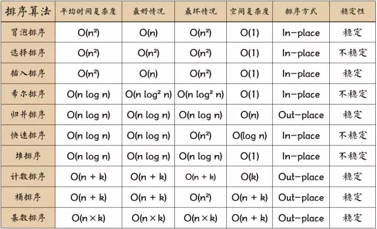
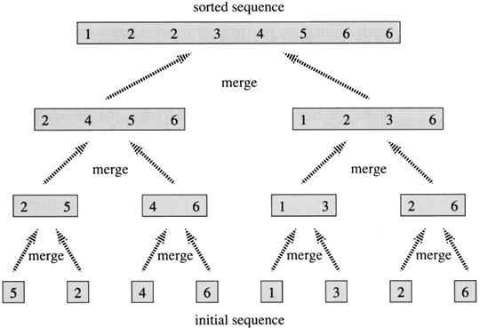

# 排序算法

- [排序算法](#%E6%8E%92%E5%BA%8F%E7%AE%97%E6%B3%95)
  - [总结](#%E6%80%BB%E7%BB%93)
  - [冒泡排序](#%E5%86%92%E6%B3%A1%E6%8E%92%E5%BA%8F)
  - [选择排序](#%E9%80%89%E6%8B%A9%E6%8E%92%E5%BA%8F)
  - [插入排序](#%E6%8F%92%E5%85%A5%E6%8E%92%E5%BA%8F)
  - [希尔排序](#%E5%B8%8C%E5%B0%94%E6%8E%92%E5%BA%8F)
  - [快速排序](#%E5%BF%AB%E9%80%9F%E6%8E%92%E5%BA%8F)
  - [堆排序](#%E5%A0%86%E6%8E%92%E5%BA%8F)
  - [基数排序](#%E5%9F%BA%E6%95%B0%E6%8E%92%E5%BA%8F)
  - [归并排序](#%E5%BD%92%E5%B9%B6%E6%8E%92%E5%BA%8F)
## 总结



---

## 冒泡排序

  > 通过两个相邻元素的比较来把最小或者最大的数交换到最后面

  平均复杂度 | 最好 | 最坏 | 空间 | 稳定性
  --- | --- | --- | --- | ---
  O(n^2) | O(n) | O(n^2) | O(1) | 稳定


  - 最快：正序
  - 最慢： 逆序

  ``` javascript
  function bubbleSort(arr) {
    var len = arr.length;
    for (var i = 0; i < len; i++) {
      for (var j = 0; j < len - 1 - i; j++) {
        if (arr[j] > arr[j+1]) {      //相邻元素两两对比
          var temp = arr[j+1];        //元素交换
          arr[j+1] = arr[j];
          arr[j] = temp;
        }
      }
    }
    return arr;
  }
  ```


  

## 选择排序

  > 选择一个最小/最大的数，记录下标，然后进行交换

  平均复杂度 | 最好 | 最坏 | 空间 | 稳定性
  --- | --- | --- | --- | ---
  O(n^2) | O(n^2) | O(n^2) | O(1) | 不稳定

  ``` javascript
  function selectionSort(arr) {
    var len = arr.length;
    var minIndex, temp;
    for (var i = 0; i < len - 1; i++) {
      minIndex = i;
      for (var j = i + 1; j < len; j++){
        if (arr[j] < arr[minIndex]) {     //寻找最小的数
          minIndex = j;                 //将最小数的索引保存
        }
      }
      temp = arr[i];
      arr[i] = arr[minIndex];
      arr[minIndex] = temp;
    }
    return arr;
  }
  ```

## 插入排序

  > 循环把一个数插入到**有序序列**中


  平均复杂度 | 最好 | 最坏 | 空间 | 稳定性
  --- | --- | --- | --- | ---
  O(n^2) | O(n) | O(n^2) | O(1) | 稳定

  ``` javascript
  function insertionSort(arr) {
    var len = arr.length
    var preIndex, current
    for (var i = 1; i < len; i++) {
      preIndex = i - 1
      current = arr[i]
      // 向前比较 （前：有序序列）
      while(preIndex >= 0 && arr[preIndex] > current) {
        arr[preIndex+1] = arr[preIndex]
        preIndex--
      }
      arr[preIndex+1] = current
    }
    return arr
  }
  ```

## 希尔排序

  > 按照**某一个增量(gap)**分成若干组，第一次增量为排序数的一半(或者是其他**动态定义间隔**)，每组的下标相差都是这个增量，然后每组的全部元素进行插入排序，排序完后，增量减小为原来增量的一半，再次进行分组和排序，当增量为 1, 进行插入排序之后，排序完成

  平均复杂度 | 最好 | 最坏 | 空间 | 稳定性
  --- | --- | --- | --- | ---
  O(n^1.3) | O(n) | O(n^2) | O(1) | 不稳定

  ``` javascript
  function shellSort(arr) {
    var len = arr.length,
        temp,
        gap = 1;
    while(gap < len/3) {          // 动态定义间隔序列
        gap =gap*3+1;
    }
    for (gap; gap > 0; gap = Math.floor(gap/3)) {
      for (var i = gap; i < len; i++) {
        temp = arr[i];
        for (var j = i-gap; j >= 0 && arr[j] > temp; j-=gap) {
          arr[j+gap] = arr[j];
        }
        arr[j+gap] = temp;
      }
    }
    return arr;
  }
  ```

## 快速排序

  > **分治法典型应用**。

  快速排序一般基于递归实现。其思路是这样的：

  - 选定一个合适的值（理想情况中值最好，但实现中一般使用数组第一个值）,称为**枢轴(pivot)**。

  - 基于这个值，将数组分为两部分，较小的分在左边，较大的分在右边。

  - 可以肯定，如此一轮下来，这个枢轴的位置一定在最终位置上。

  - 对两个子数组分别重复上述过程，直到每个数组只有一个元素。

  - 排序完成。

  平均复杂度 | 最好 | 最坏 | 空间 | 稳定性
  --- | --- | --- | --- | ---
  O(n log n) | O(n log n) | O(n^2) | O(log n) | 不稳定

  ``` javascript

  function Qsort(arr) {
    let len = arr.length
    let __sort = function sort(arr, low, high) {
      let partitionIndex;
      if (low < high) {
        partitionIndex = partition(arr, low, high)
        sort(arr, low, partitionIndex - 1)
        sort(arr, partitionIndex + 1, high)
      }
    }
    
    __sort(arr, 0, len-1)
    console.log(arr)
  }

  // 交换位置，并获得枢轴
  function partition(arr, low, high) {
    let pivot = arr[low]
    while (low < high) {
      while (low < high && arr[high] >= pivot) {
        high-- 
      }
      arr[low] = arr[high]
      while (low < high && arr[low] <= pivot) {
        low++
      }
      arr[high] = arr[low]
    }
    arr[low] = pivot
    return low
  }
  ```
  [参考](https://www.cnblogs.com/codeskiller/p/6360870.html)

## 堆排序

  实现思想：

  - 将无需序列构建成一个堆，根据升序降序需求选择大顶堆或小顶堆;

  - 将堆顶元素与末尾元素交换，将最大元素"沉"到数组末端;

  - 重新调整结构，使其满足堆定义，然后继续交换堆顶元素与当前末尾元素，反复执行调整+交换步骤，直到整个序列有序。

  缺点：堆的维护问题，实际场景中的数据是频繁发生变动的，而对于待排序序列的每次更新（增，删，改），我们都要重新做一遍堆的维护，以保证其特性，这在大多数情况下都是没有必要的

  平均复杂度 | 最好 | 最坏 | 空间 | 稳定性
  --- | --- | --- | --- | ---
  O(n log n) | O(n log n) | O(n log n) | O(1) | 不稳定

  代码参考：

  ``` javascript
  //这里为方便起见把len设成为全局
  var len;    

  //建立大顶堆
  function buildMaxHeap(arr) {   
    len = arr.length;
    for (var i = Math.floor(len/2); i >= 0; i--) {
        heapify(arr, i);
    }
  }
  //堆调整
  function heapify(arr, i) {     
    var left = 2 * i + 1,
        right = 2 * i + 2,
        largest = i;

    if (left < len && arr[left] > arr[largest]) {
        largest = left;
    }

    if (right < len && arr[right] > arr[largest]) {
        largest = right;
    }

    if (largest != i) {
        swap(arr, i, largest);
        heapify(arr, largest);
    }
  }
  
  function swap(arr, i, j) {
    var temp = arr[i];
    arr[i] = arr[j];
    arr[j] = temp;
  }
    
  function heapSort(arr) {
    buildMaxHeap(arr);

    for (var i = arr.length-1; i > 0; i--) {
      swap(arr, 0, i);
      len--;
      heapify(arr, 0);
    }
    return arr;
  }
  ```

## 基数排序

  > 实现：将整数按位数切割成不同的数字，然后按每个位数分别比较

  排序过程：
  
  - 将所有待比较数值（正整数）统一为同样的数位长度，数位较短的数前面补零。

  - 从最低位开始，依次进行一次排序。
  
  - 这样从最低位排序一直到最高位排序完成以后，数列就变成一个有序序列。

  基数排序法会使用到**桶 (Bucket)**，顾名思义，通过将要比较的位（个位、十位、百位…），将要排序的元素分配至 0~9 个桶中，借以达到排序的作用，在某些时候，基数排序法的效率高于其它的比较性排序法。

  平均复杂度 | 最好 | 最坏 | 空间 | 稳定性
  --- | --- | --- | --- | ---
  O(n * k) | O(n * k) | O(n * k) | O(n + k) | 不稳定
  (k: "桶"的个数)

  [参考](http://bubkoo.com/2014/01/15/sort-algorithm/radix-sort/)
  
  代码参考：

  ``` javascript

    function radixSort(array) {
      var bucket = [],
          l = array.length,
          loop,
          str,
          i,
          j,
          k,
          t,
          max = array[0];
      for (i = 1; i < l; i++) {
          if (array[i] > max) {
              max = array[i]
          }
      }
      loop = (max + '').length;
      for (i = 0; i < 10; i++) {
          bucket[i] = [];
      }
      for (i = 0; i < loop; i++) {
          for (j = 0; j < l; j++) {
              str = array[j] + '';
              if (str.length >= i + 1) {
                  k = parseInt(str[str.length - i - 1]);
                  bucket[k].push(array[j]);
              } else { // 高位为 0
                  bucket[0].push(array[j]);
              }
          }
          array.splice(0, l);
          for (j = 0; j < 10; j++) {
              t = bucket[j].length;
              for (k = 0; k < t; k++) {
                  array.push(bucket[j][k]);
              }
              bucket[j] = [];
          }
      }
      return array;
    }

  ```

## 归并排序

  > 实现：将两个已经排序的序列合并成一个序列的操作. 也是**分治法**

  

  - 分解----将序列每次折半拆分

  - 合并----将划分后的序列段两两排序合并

  因此，归并排序实际上就是两个操作，拆分+合并

  - 如何分解？

    在这里，我们采用递归的方法，首先将待排序列分成A,B两组；然后重复对A、B序列分组；直到分组后组内只有一个元素，此时我们认为组内所有元素有序，则分组结束。
    
  - 如何合并？

    L[first...mid]为第一段，L[mid+1...last]为第二段，并且两端已经有序，现在我们要将两端合成达到L[first...last]并且也有序。

    首先依次从第一段与第二段中取出元素比较，将较小的元素赋值给temp[]
    重复执行上一步，当某一段赋值结束，则将另一段剩下的元素赋值给temp[]
    此时将temp[]中的元素复制给L[]，则得到的L[first...last]有序

  
  平均复杂度 | 最好 | 最坏 | 空间 | 稳定性
  --- | --- | --- | --- | ---
  O(n log n) | O(n log n) | O(n log n) | O(n) | 稳定

  [“深入理解”—归并排序算法](http://blog.csdn.net/qq_25827845/article/details/70994874)

  [常见排序算法 - 归并排序 (Merge Sort)](http://bubkoo.com/2014/01/15/sort-algorithm/merge-sort/)

  ``` javascript
    function mergeSort(arr) {  //采用自上而下的递归方法
      var len = arr.length;
      if(len < 2) {
        return arr;
      }
      var middle = Math.floor(len / 2),
          left = arr.slice(0, middle),
          right = arr.slice(middle);
      return merge(mergeSort(left), mergeSort(right));
    }

    function merge(left, right){
      var result = [];

      while (left.length && right.length) {
        if (left[0] <= right[0]) {
          result.push(left.shift());
        } else {
          result.push(right.shift());
        }
      }

      while (left.length)
        result.push(left.shift());

      while (right.length)
        result.push(right.shift());

      return result;
    }
  ```