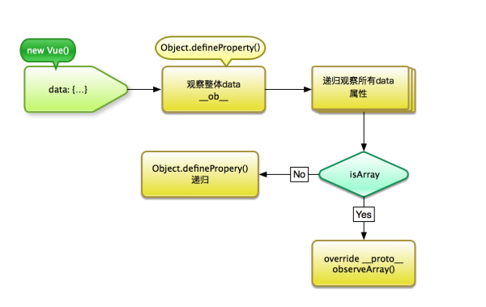

# Vue响应式原理

- [Vue响应式原理](#vue%E5%93%8D%E5%BA%94%E5%BC%8F%E5%8E%9F%E7%90%86)
  - [主要的对象](#%E4%B8%BB%E8%A6%81%E7%9A%84%E5%AF%B9%E8%B1%A1)
    - [初始化实例中的 `initData()`](#%E5%88%9D%E5%A7%8B%E5%8C%96%E5%AE%9E%E4%BE%8B%E4%B8%AD%E7%9A%84-initdata)
    - [Observer](#observer)
    - [`defineReactive` —— 劫持数据的核心](#definereactive-%E2%80%94%E2%80%94-%E5%8A%AB%E6%8C%81%E6%95%B0%E6%8D%AE%E7%9A%84%E6%A0%B8%E5%BF%83)
    - [`Watcher `](#watcher)
  - [实例分析](#%E5%AE%9E%E4%BE%8B%E5%88%86%E6%9E%90)
  - [参考](#%E5%8F%82%E8%80%83)


大致过程：

- **`Watcher` 的生成**

  在 Vue 中模板编译过程中的指令或者数据绑定都会实例化一个 `Watcher` 实例，实例化过程中会触发 `get()` 将自身指向 `Dep.target`;

- **依赖收集**

  data 在 `Observer` 时执行 `getter` 会触发 `dep.depend()` 进行**依赖收集**; 依赖收集的结果：
  - 1、data在 `Observer` 时闭包的 `dep` 实例的 `subs` 添加观察它的 `Watcher` 实例
  - 2、 `Watcher` 的 `deps` 中添加观察对象 `Observer` 时的闭包 `dep`；
  
- **数据更新**

> 当 `data` 中被 `Observer` 的某个对象值变化后，触发 `subs` 中观察它的 `watcher` 执行 `update()` 方法，最后实际上是调用 `watcher` 的回调函数cb，进而更新视图。
>
> `Vue` 中初始化渲染时，视图上绑定的数据就会实例化一个 `Watcher`，**依赖收集就是是通过属性的 getter 函数完成的**，`Observer` 、`Watcher` 、`Dep` 都与依赖收集相关。
>
> 其中 `Observer` 与 `Dep` 是一对一的关系， `Dep` 与 `Watcher` 是多对多的关系，`Dep` 则是 `Observer` 和 `Watcher` 之间的纽带。
>
> 依赖收集完成后，当属性变化会执行被 `Observer` 对象的 `dep.notify()` 方法，这个方法会遍历订阅者（`Watcher`）列表向其发送消息

---
## 主要的对象

### 初始化实例中的 `initData()`

  ``` javascript
  function initData (vm: Component) {
    /*得到data数据*/
    let data = vm.$options.data
    data = vm._data = typeof data === 'function'
      ? getData(data, vm)
      : data || {}defi
    // 省略
    // observe data
    observe(data, true /* asRootData */)
  }
  ```

  这里主要做了两件事
  - 一是将 `_data` 上面的数据代理到 `vm` 上
  - 二是通过执行 `observe(data, true)`将所有 `data` 变成可观察的，即对 `data` 定义的每个属性进行 `getter/setter` 操作，这里就是 Vue 实现响应式的基础
  - `observe` 方法则是 `new` 一个 `Observer` 类

### Observer

  `Observer`类 是将每个目标对象（即data）的键值转换成getter/setter 形式，用于进行依赖收集以及调度更新。

  - 首先将 `Observer`实例绑定到 `data` 的 `__ob__` 属性上面去，防止重复绑定；
  - 若data为数组，先实现对应的变异方法（Vue重写了数组的7种原生方法），再将数组的每个成员进行 `observe` ，使之成响应式数据；
  - 执行 `walk()` 方法，遍历 `data` 所有的数据，进行`getter/setter` 绑定，这里的核心方法就是 `defineReative(obj, keys[i], obj[keys[i]])`

### `defineReactive` —— 劫持数据的核心

  
  
  部分代码
  ``` javascript
  export function defineReactive () {
    const dep = new Dep()
    // 省略...
    Object.defineProperty(obj, key, {
      enumerable: true,
      configurable: true,
      get: function reactiveGetter () {
        const value = getter ? getter.call(obj) : val
        // 省略...
        if (Dep.target) {
          /* 进行依赖收集 */
          dep.depend()
        }
        return value
      },
      set: function reactiveSetter (newVal) {
        const value = getter ? getter.call(obj) : val
        // 省略...
        /* dep对象通知所有的观察者 */
        dep.notify()
      }
    })
  }
  ```
  先为每个 `data` 声明一个 `Dep` 实例对象, `Dep` 是一个消息订阅器, 它会收集订阅者, 当数据变更时, 通过消息订阅器可以通知所有的订阅者触发其更新操作，接着劫持每个对象属性的 `getter` 和 `setter`
  - 在 `setter` 中

    通过 `dep` 对象通知所有观察者去更新数据，从而达到响应式效果
    
  - 在 `getter` 中
   
    根据 `Dep.target` 来判断是否收集依赖，还是普通取值, 执行 `dep.depend()` 进行收集相关的依赖

    依赖收集简单点理解就是收集只在实际页面中用到的 data 数据，然后打上标记，这里就是标记为 `Dep.target`

    `Dep.target` 是在 `Watcher` 中获取到的

### `Watcher `

  `Watcher` 是一个观察者对象, 实现了订阅监听, 是在 **Vue 模板编译的最后一步** 创建的. 依赖收集以后 `Watcher` 对象会被保存在 `Dep` 的 `subs` 中，数据变动的时候 `Dep` `会通知Watcher` 实例，然后由 `Watcher` 实例回调 `cb` 进行视图的更新

  `Watcher` 里面比较重要的方法

  ``` javascript 
  get () {
    pushTarget(this)
    try {
    	value = this.getter.call(vm, vm)
    } 
    // 省略
    popTarget()
    this.cleanupDeps()
    }
    return value
  }
  ```
  `pushTarget` 即是把当前的 `Dep.target` 设置为自己. 接着立即调用了本身的 `getter` 方法. 这就又回到了我们刚刚拦截 `getter` 的地方了, 此时检测到 `Dep.target` 不为空, 因此会进行依赖收集处理

---
## 实例分析

  ``` javascript
  data () {
    return {
      a: {
      }
    }
  }
  ```

  我们分析下其被观察的过程:

  - data
    - observe(data)
      - new Observer(data) 转为可观察对象, 创建了消息订阅器 data.dep
      - 遍历 key 调用 defineReactive 方法

  - data.a
    - defineReactive(data, 'a', data.a)
      - 创建了消息订阅器 dep1
      - observe(data.a)
        - new Observer(data.a) 转为可观察对象, 创建了消息订阅器 data.a.dep
        - 遍历 key 调用 defineReactive 方法
      - 劫持 data.a 的 getter 和 setter. 当有依赖 data.a 的订阅者 watcher 出现时, watcher 把自身加入到了 dep1 的订阅者列表中, 同时 dep1 也被加入到 watcher 的依赖中. 接着, 因为 data.a.dep 存在, 也同样进行依赖收集和订阅.

---
## 参考

- [Vue 双向绑定原理](https://ruiming.me/two-way-binding-of-vue/)

- [深入理解Vue响应式原理](http://jungahuang.com/2018/02/07/About-responsive-of-Vue/#1%E3%80%81initData)

- 

- [Vue双向绑定实现原理(**这是有简单实现!!**)](http://www.upyang.com/2017/09/15/Vue%E5%8F%8C%E5%90%91%E7%BB%91%E5%AE%9A%E5%8E%9F%E7%90%86/#%E4%BB%BB%E5%8A%A1%E5%88%86%E8%A7%A3)